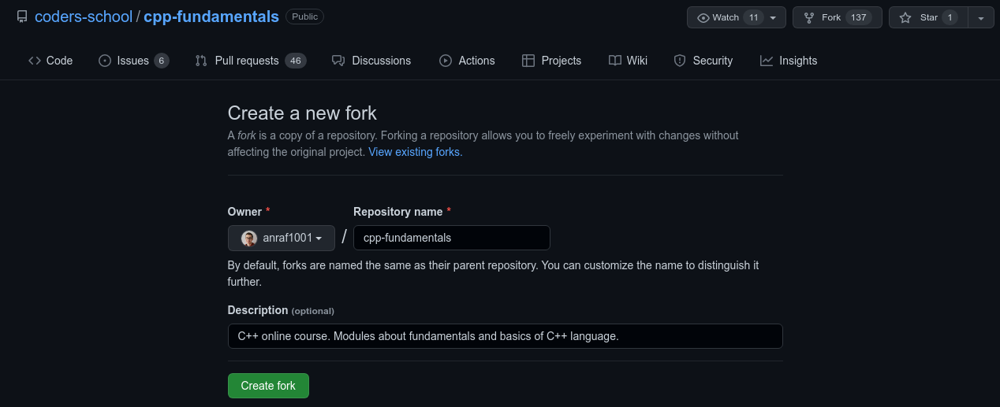
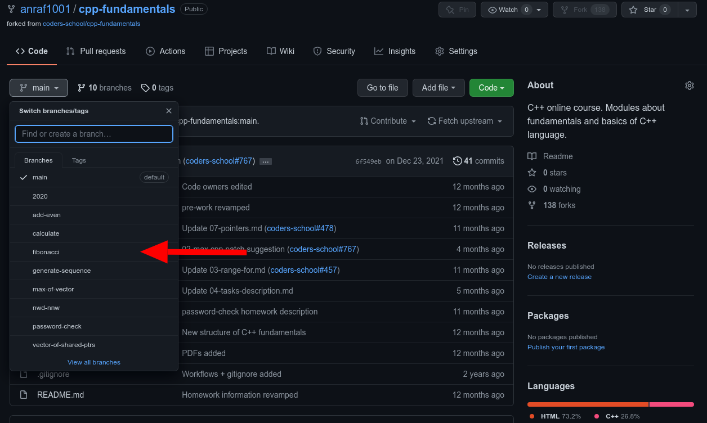
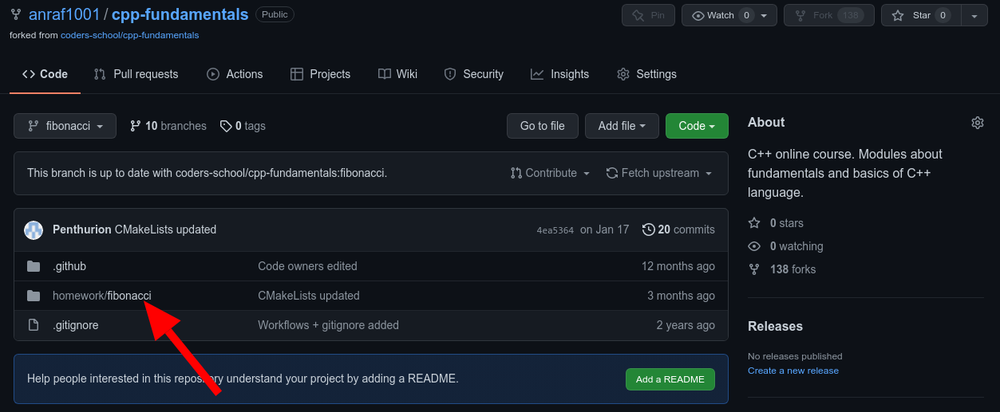
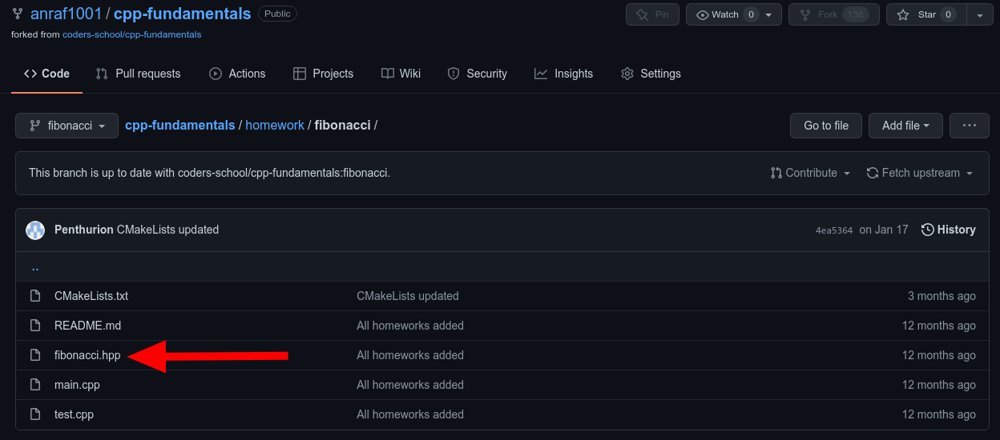
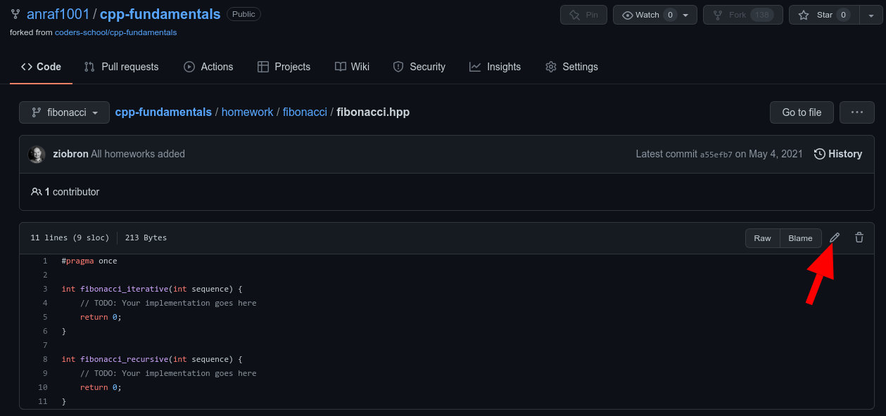
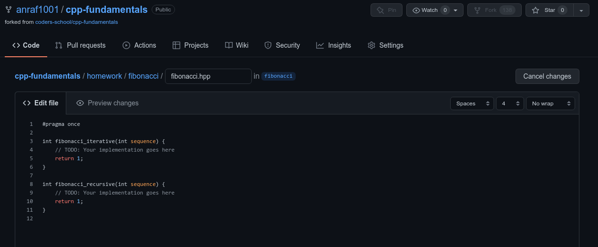
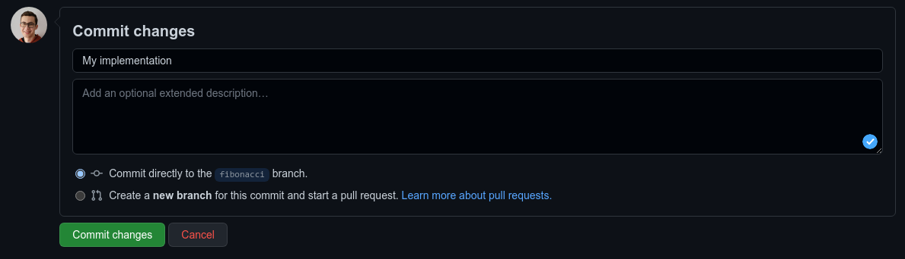
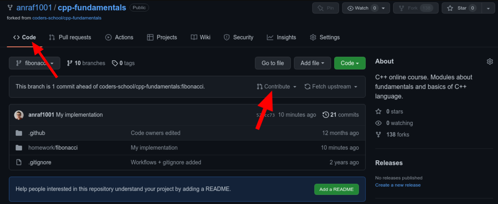
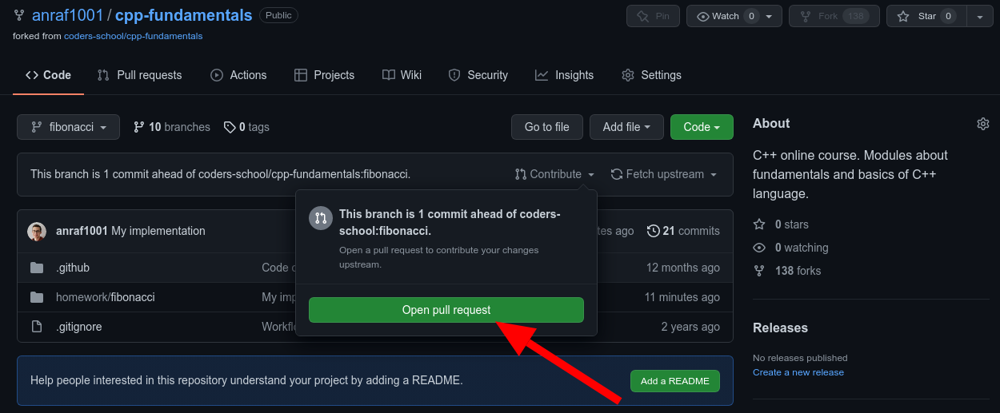

# Dostarczanie rozwiązania zadania za pomocą GitHuba
## Stworzenie forka repozytorium
Jeśli chcemy dostarczyć rozwiązanie zadania, to w pierwszej kolejności powinniśmy stworzyć forka, czyli kopię repozytorium, do którego chcemy dostarczyć rozwiązanie. Możemy to zrobić klikając w przycisk `Fork` widoczny na stronie repozytorium.

Po kliknięciu w przycisk GitHub zapyta nas jak chcemy nazwać naszego forka. Domyślną nazwą forka jest nazwa oryginalnego repozytorium i taką też możemy pozostawić. Klikamy na zielony przycisk `Create fork`

## Wybranie odpowiedniej gałęzi
Po kliknięciu w przycisk zostaniemy automatycznie przeniesieni na stronę naszego forka.
Rozwiązania zadań powinniśmy umieszczać na odpowiednich gałęziach (*ang. branch*).
Gałąź możemy wybrać klikając na nazwę aktualnej gałęzi w lewym górnym rogu (w naszym przypadku `main`), a następnie klikamy w nazwę gałęzi, na którą chcemy się przełączyć.
W naszym przykładzie chcemy dostarczyć rozwiązanie zadania `fibonacci`, dlatego wybieramy gałąź o tej samej nazwie.

Po przejściu na odpowiednią gałąź, przechodzimy do folderu z zadaniem domowym (w przypadku `homework/fibonacci`).
Następnie wybieramy plik, w którym znajduje się implementacja zadania (`fibonacci.hpp`).

## Stworzenie naszej implementacji
Jeśli chcemy wprowadzić zmiany w pliku, klikamy na przycisk z ikonką ołówka.

Naszym oczom ukaże się edytor, w którym możemy wprowadzić nasze rozwiązanie zadania.
Przykładowo zmienimy wartości zwracane przez obie funkcje na 1 zamiast 0 (co oczywiście nie jest poprawnym rozwiązaniem 😉). Dobrze jest też usunąć komentarze zaczynające się od `TODO:` jeśli zrobiliśmy implementację rozwiązania.

## Dodanie commita z wprowadzonymi zmianami
Jeśli uważamy, że nasza implementacja jest gotowa, to pod edytorem mamy możliwość utworzenia commita z naszymi zmianami.
Możemy tam podać nazwę commita (np. My implementation).
Możemy też wybrać czy zmiany chcemy dodać do gałęzi, na której się znajdujemy, czy do nowo utworzonej.
Jeśli pracujemy na swoim forku, to wybieramy tę pierwszą opcję. Klikamy na przycisk `Commit changes`.

## Utworzenie Pull Requesta
Po dodaniu commita implementacja znajduje się już na naszym forku.
Jeśli chcemy ją dostarczyć do pierwotnego repozytorium, klikamy na zakładkę `Code`.
Możemy zauważyć baner informujący nas, że na gałęzi `fibonacci` znajduje się 1 zmiana więcej niż na pierwotnym repozytorium.
Klikamy na przycisk `Contribute`, a następnie na `Open pull request`.

