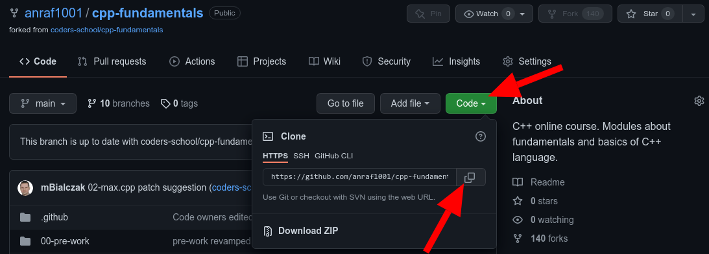

# Podstawowe użycie gita
## Instalacja gita
Przed użyciem gita na naszym komputerze, musimy go zainstalować.
Jeśli korzystamy z Ubuntu, możemy to zrobić komendą:
```
sudo apt install git
```
Sposoby instalacji gita dla innych dystrybucji Linuxa oraz Windowsa i macOSa możemy znaleźć na stronie: [Instalacja gita](https://git-scm.com/downloads).

## Sklonowanie repozytorium
Jeśli chcemy wprowadzić zmiany w repozytorium na naszym komputerze, w pierwszej kolejności musimy sklonować repozytorium (stworzyć jego lokalną kopię).
Do tego celu służy komenda:
```
git clone <link_do_repozytorium>
```
Link możemy odnaleźć, klikają na zielony przycisk `Code` na stronie głównej naszego repozytorium.


Po pobraniu repozytorium na nasz komputer przechodzimy do folderu, w który się ono znajduje (nazwa folderu jest taka jak nazwa repozytorium). Przykład:
```
cd cpp-fundamentals/
```

## Wybranie odpowiedniej gałęzi
Chcąc wprowadzić zmiany w implementacji zadania domowego, powinniśmy przełączyć się na odpowiednią dla tego niego gałąź.
Do zmiany gałęzi służy komenda:
```
git checkout <nazwa_gałęzi>
```
np. chcąc wprowadzić zmiany w zadaniu `fibonacci` powinniśmy przełączyć się na gałąź o tej samej nazwie:
```
git checkout fibonacci
```
Na wyjściu otrzymamy komunikat informujący nas, na jaką gałąź się przełączyliśmy:
```
branch 'fibonacci' set up to track 'origin/fibonacci'.
Switched to a new branch 'fibonacci'
```

W każdym momencie możemy też sprawdzić aktualną gałąź, korzystając z polecenia `git branch`.
Aktualna gałąź zostanie oznaczona za pomocą `*`.
```
* fibonacci
  main
```
Kolejnym sposobem jest wykorzystanie polecenia `git status`.
W odpowiedzi dostaniemy informację o aktualnej gałęzi, ale także czy nasza lokalna gałąź jest aktualna ze swoim odpowiednikiem na GitHubie oraz, czy zostały wprowadzone niezatwierdzone jeszcze zmiany.
```
On branch fibonacci
Your branch is up to date with 'origin/fibonacci'.

nothing to commit, working tree clean
```

## Wprowadzenie zmian w implementacji
Jeśli wprowadzimy już jakieś zmiany w naszej implementacji zadania domowego, dobrze byłoby je zatwierdzić (po nerdowsku - utworzyć commita z naszymi zmianami).

Sprawdźmy, w jakich plikach znajdują się wprowadzone przez nas zmiany.
```
git status
```

Przykładowe wyjście:
```
On branch fibonacci
Your branch is up to date with 'origin/fibonacci'.

Changes not staged for commit:
  (use "git add <file>..." to update what will be committed)
  (use "git restore <file>..." to discard changes in working directory)
	modified:   homework/fibonacci/fibonacci.hpp

no changes added to commit (use "git add" and/or "git commit -a")
```

W naszym przypadku widzimy, że mamy niezatwierdzone zmiany w pliku `homework/fibonacci/fibonacci.hpp`.

Następnie dodajemy nasze zmiany na listę zmian, które mają zostać zatwierdzone. Korzystamy z polecenia `git add`.
```
git add homework/fibonacci/fibonacci.hpp
```

Po użyciu polecenia `git status` możemy zauważyć, że zmiany w naszym pliku zostały przeniesione do sekcji `Changes to be committed`.
```
On branch fibonacci
Your branch is up to date with 'origin/fibonacci'.

Changes to be committed:
  (use "git restore --staged <file>..." to unstage)
	modified:   homework/fibonacci/fibonacci.hpp
```

Chcąc zatwierdzić zmiany, używamy polecenia `git commit -m <nazwa_commita>`.
Przykładowo:
```
git commit -m "Add fibonacci implementation"
```

Podczas zatwierdzania zmian możemy otrzymać błąd:
```
Author identity unknown

*** Please tell me who you are

Run

  git config --global user.email "you@example.com"
  git config --global user.name "Your Name"

to set your account's default identity.
```
Jeśli tak się stanie, dodajemy nasze dane do konfiguracji gita zgodnie z instrukcją.
Przykładowo:
```
git config --global user.email "jan@kowalski.com"
```
```
git config --global user.name "Jan Kowalski"
```
Po dodaniu naszych danych do konfiguracji możemy już ponownie dodać commita korzystając z polecenia `git commit -m <nazwa_commita>`.

Po dodaniu naszych zmian możemy sprawdzić, czy faktycznie zostały one dodane, korzystając z polecenia `git log --oneline`.
Wyświetlona zostanie historia dodanych commitów.
na samej górze znajduje się najnowszy commit tj. dodany przez.
```
030eb8f (HEAD -> fibonacci) Add fibonacci implementation
```

## Wysłanie zmian do repozytorium na GitHubie
Zatwierdzone przez nas zmiany znajdują się już w naszej lokalnej kopii repozytorium. Jeśli chcemy wysłać wprowadzone zmiany na nasze repozytorium na GitHubie, korzystamy z polecenia `git push`.

Po wysłaniu zmian na GitHuba możemy np. dodać pull requesta z naszego forka do bazowego repozytorium.
